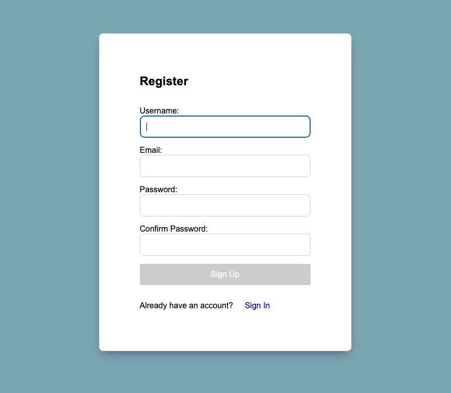
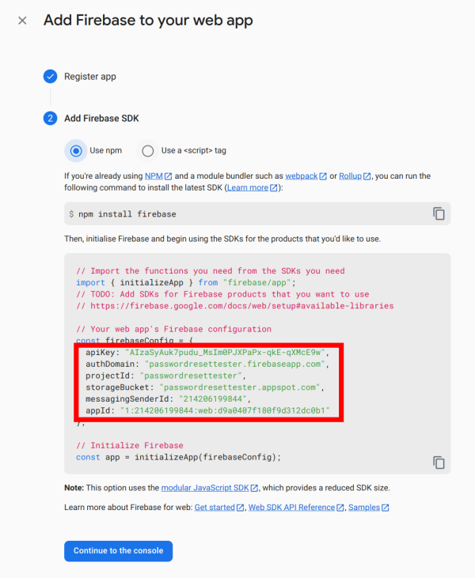

# User Authentication

This project was created with the primary goal of exploring the intricacies of user authentication within web applications.


It serves as a practical exploration of implementing authentication features using Firebase Authentication and React.js.

## Purpose
The main purpose of this project is to provide developers with a comprehensive understanding of user authentication mechanisms, including registration, login, password reset, and email verification processes. By delving into the implementation details of these features, developers can gain valuable insights into securing web applications and protecting user data.

## Reusability
One of the key benefits of this project is its reusability. The codebase can serve as a foundation for building authentication systems in a wide range of web applications, from simple blogs to complex e-commerce platforms. Developers can adapt and extend the functionality to suit their specific requirements, making it a versatile resource for projects of varying scales and scopes.

## Getting Started
To get started with using this project, follow the installation instructions provided in the README. Once set up, developers can explore the codebase, customize the authentication flows, and integrate them seamlessly into their own applications.

## Table of Contents

- [Demo](#demo)
- [Features](#features)
- [Security Features](#security-features)
- [Prerequisites](#prerequisites)
- [Installation](#installation)
- [License](#license)

## Demo

You can view a live demo of the application [here](https://julianalbert12.github.io/User-Authentication/).

## Features
- User Registration with Email Verification
- User Login
- Password Reset
- Logout functionality

## Security Features
- Client-side validation for email format
- Require strong passwords 
- Input validation: regular expressions to ensure they meet the required criteria
- Preventing Duplicate Emails: Checks are performed to ensure that the email address provided during registration does not already exist in the system
- Sanitized user inputs before sent to Firebase
- Secure Environment Variables for Firebase config

## Prerequisites
- npm installed on your machine
- Firebase account for authentication.
- [Get started here](https://firebase.google.com/docs/firestore) for Firebase instructions

## Installation
1. Clone the repository to your local machine:
```
git clone https://github.com/Julianalbert12/User-Authentication.git
```
2. Navigate to the project directory:
```
cd User-Authentication
```
3. Install dependencies:
```
npm install
```
4. Once you have created your Firebase account you will recieve configurations like this:


5. Once you recieve your configurations, create a '.env' file in the root directory and add your Firebase configuration:
```
REACT_APP_FIREBASE_API_KEY=your_api_key
REACT_APP_FIREBASE_AUTH_DOMAIN=your_auth_domain
REACT_APP_FIREBASE_PROJECT_ID=your_project_id
REACT_APP_FIREBASE_STORAGE_BUCKET=your_storage_bucket
REACT_APP_FIREBASE_MESSAGING_SENDER_ID=your_messaging_sender_id
REACT_APP_FIREBASE_APP_ID=your_app_id
```
6. On a separate terminal, run project:
```
npm start
```

## License
This project is licensed under the MIT License. See the LICENSE file for more information.


